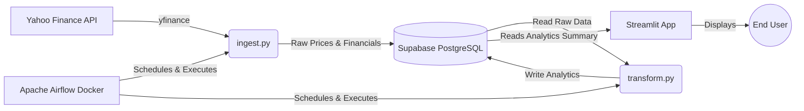

# NIFTY IT Equity Research Data Pipeline

## Table of Contents
1. [Project Overview](#1-project-overview)
2. [Architecture](#2-architecture)
3. [Tech Stack](#3-tech-stack)
4. [Data Pipeline (ETL) Deep Dive](#4-data-pipeline-etl-deep-dive)
5. [Database Schema](#5-database-schema)
6. [Streamlit App](#6-streamlit-app)
7. [File and Folder Structure](#7-file-and-folder-structure)
8. [Setup & Installation](#8-setup--installation)
9. [Deployment](#9-deployment)
10. [Challenges & Decisions](#10-challenges--decisions)
11. [Future Improvements](#11-future-improvements)
12. [License & Contact](#12-license--contact)

---

## 1. Project Overview
**What this project does:**  
This project is an end-to-end automated Data Engineering pipeline that extracts, transforms, and visualizes financial data for top Indian IT companies. It fetches daily stock prices and fundamental metrics, performs data quality checks and imputations, calculates business metrics, and serves the results through a live interactive dashboard.

**Data Scope:**  
Focuses on the **NIFTY IT** index components. Currently tracking:
* Infosys (`INFY.NS`)
* Tech Mahindra (`TECHM.NS`)
* Wipro (`WIPRO.NS`)
* HCL Technologies (`HCLTECH.NS`)

**Use Case / Audience:**  
This project demonstrates production-grade Data Engineering capabilities. It is designed for recruiters, hiring managers, and data engineers to showcase expertise in Python ETL, Data Quality, SQL Upsert logic, Docker, Orchestration (Apache Airflow), Cloud Databases (Supabase), and Frontend visualization (Streamlit).

---

## 2. Architecture
### High-Level System Architecture


**Data Flow:**
1. **Source:** Yahoo Finance API (`yfinance`).
2. **Extraction:** Python scripts running inside Airflow Docker containers pull the data daily.
3. **Storage (Raw):** Data is loaded into a Cloud PostgreSQL database (Supabase) using Upsert logic to prevent duplicates.
4. **Transformation:** A second Python script pulls the raw data, applies business logic (rolling averages, profit margins), handles missing data (imputation), and writes back to an analytics table.
5. **Visualization:** A Streamlit web application connects directly to Supabase to visualize the transformed data.

**Tradeoffs Considered:**
* *Python vs. dbt for Transformations:* Chose Python (Pandas) for transformations to easily handle complex time-series imputations and rolling averages, though dbt would be preferable for pure SQL environments.
* *Supabase vs. Local Postgres:* Migrated from a local Docker Postgres to Supabase to enable a live, public Streamlit deployment without needing complex reverse proxies.

---

## 3. Tech Stack
* **Language:** Python 3.x
* **Orchestration:** Apache Airflow 2.8.1 (running via Docker Compose)
* **Database:** PostgreSQL (Hosted on Supabase Cloud)
* **Data Manipulation:** `pandas`
* **Data Extraction:** `yfinance`
* **Database ORM/Drivers:** `SQLAlchemy`, `psycopg2-binary`
* **Visualization:** `streamlit`, `plotly`
* **Config Management:** `python-dotenv`

---

## 4. Data Pipeline (ETL) Deep Dive
### Extraction (`ingest.py`)
* **Sources:** Fetches 1-month historical price data and trailing fundamentals (P/E, Revenue, Net Income) via `yfinance`.
* **Data Quality (V2):** 
    * Checks for 0-row API responses.
    * Forward-fills missing close prices and flags them as `IMPUTED_API_OUTAGE`.
    * Flags zero-volume days as `MARKET_HALT`.
    * Detects >20% daily price swings (anomalies) and logs them as warnings (for potential stock splits).
* **Idempotency:** Inserts into a temporary table first, then uses `ON CONFLICT (date, ticker) DO NOTHING` to guarantee duplicate-free runs.

### Transformation (`transform.py`)
* **Process:** Pulls from `raw_prices` and `raw_financials`.
* **Business Logic:** 
    * Calculates a **7-day rolling average** for close prices.
    * Computes **Net Profit Margin %** entirely in SQL (`(net_income / NULLIF(total_revenue, 0)) * 100`).
* **Loading:** Merges the price and financial dataframes and performs a bulk `ON CONFLICT DO UPDATE` into the `analytics_summary` table.

### Orchestration (`dags/equity_pipeline_dag.py`)
* **Structure:** A straightforward Airflow DAG utilizing `BashOperator`.
* **Dependencies:** `run_ingestion` >> `run_transformation`.
* **Scheduling:** Runs Monday through Friday at 23:00 UTC (`0 23 * * 1-5`).
* **Retries:** Configured for 1 retry with a 5-minute delay.

---

## 5. Database Schema
The project uses a standard star/snowflake hybrid model optimized for analytics.

| Table | Columns | Primary Key | Description |
|---|---|---|---|
| `raw_prices` | date, ticker, open, high, low, close, volume, data_status | (date, ticker) | Daily OHLCV data directly from API |
| `raw_financials` | fetch_date, ticker, trailing_pe, total_revenue, net_income | (fetch_date, ticker) | Slowly changing fundamental metrics |
| `analytics_summary` | date, ticker, close_price, rolling_7d_avg, net_profit_margin_pct, pe_ratio, data_status | (date, ticker) | The golden table serving the Streamlit frontend |
| `pipeline_logs` | run_id, execution_time, task_name, status, records_processed, error_message | run_id | Custom audit table for pipeline runs and DQ alerts |

---

## 6. Streamlit App
The dashboard (`app.py`) is designed for executives and analysts:
* **Sidebar:** Features a dynamic "Pipeline Sync Status" indicator that queries `pipeline_logs` to ensure data is fresh. Allows ticker selection.
* **KPI Cards:** Displays the latest Close Price (with Day-over-Day delta and Plotly sparkline), P/E Ratio (with Sector Average benchmark), and Net Profit Margin.
* **Alerts:** Dynamically surfaces warnings if the selected date's data was imputed due to API outages or market halts.
* **Main Chart:** A Plotly line chart comparing the stock's Close Price against its 7-Day Rolling Average and the broader NIFTY IT Sector Index.

---

## 7. File and Folder Structure
```text
/Fin
├── app.py                      # The Streamlit dashboard application
├── ingest.py                   # Data extraction script (Yahoo Finance -> Raw DB)
├── transform.py                # Data transformation script (Raw DB -> Analytics DB)
├── create_tables.sql           # DDL script for initializing PostgreSQL tables
├── docker-compose.yaml         # Official Airflow Docker Compose configuration
├── requirements.txt            # Python dependencies
├── .env                        # Environment variables (Database credentials)
└── dags/
    └── equity_pipeline_dag.py  # Airflow DAG definition
```

---

## 8. Setup & Installation
### Local Setup
1. **Clone the repository.**
2. **Create a `.env` file** in the root directory:
   ```env
   DB_USER=postgres.your_supabase_project_id
   DB_PASSWORD=YourDatabasePassword
   DB_HOST=aws-0-ap-northeast-1.pooler.supabase.com
   DB_PORT=6543
   DB_NAME=postgres
   AIRFLOW_UID=50000
   ```
3. **Initialize Database Schema:** Run the contents of `create_tables.sql`, then manually run `ALTER TABLE raw_prices ADD COLUMN data_status VARCHAR(50);` to patch V2 DQ features.
4. **Start Airflow:** Run `docker compose up -d`.
5. **Trigger Pipeline:** Navigate to `http://localhost:8080` (login: airflow/airflow) and unpause/trigger the `nifty_it_equity_pipeline` DAG.
6. **Run Streamlit Locally:** 
   ```bash
   pip install -r requirements.txt
   streamlit run app.py
   ```

---

## 9. Deployment
* **Database:** Hosted on **Supabase**. Connected using Supabase's IPv4 connection pooler (Port 6543) in Session Mode.
* **Frontend:** Deployed on **Streamlit Community Cloud** directly from GitHub.
* **Secrets Management:** Database credentials are securely injected via Streamlit's `Advanced Settings -> Secrets` manager.
* **Orchestration:** Airflow runs locally via Docker, continuously pushing fresh data to the cloud database.

---

## 10. Challenges & Decisions
1. **Docker / Windows Networking:** Encountered limitations with Supabase's direct connection (Port 5432) requiring IPv6, which Docker Desktop on Windows struggles with. *Solution:* Pivoted to the Supabase Connection Pooler on Port 6543, which natively supports IPv4.
2. **SQLAlchemy Password Encoding:** Passwords containing special characters (`@`) caused SQL connection parsing errors. *Solution:* Utilized `sqlalchemy.engine.URL.create()` to safely encode the connection string dynamically.
3. **Supabase ECIRCUITBREAKER:** Heavy retry attempts during initial password failures triggered Supabase's anti-brute-force firewall. *Solution:* Changed the master DB password to avoid special characters entirely and implemented structured backoff logging.
4. **Idempotency:** Implemented `ON CONFLICT DO UPDATE` (Upsert) logic rather than basic appends. This allows the Airflow DAG to be safely rerun multiple times a day without duplicating data.

---

## 11. Future Improvements
* **DBT Integration:** Migrate the Pandas transformation logic (`transform.py`) into dbt models for better lineage and testing.
* **Cloud Orchestration:** Move the Airflow instance from local Docker to AWS Managed Workflows for Apache Airflow (MWAA) or Astronomer for a 100% cloud-native architecture.
* **Technical Indicators:** Add RSI, MACD, and Bollinger Bands to the Streamlit visualization.
* **CI/CD:** Add GitHub Actions to run linting and unit tests on pushes.

---

## 12. License & Contact
Developed by **Abhinav Shandilya**.  
Feel free to reach out or open issues if you have suggestions or questions about the pipeline architecture!
